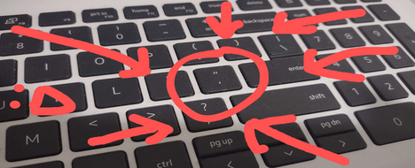
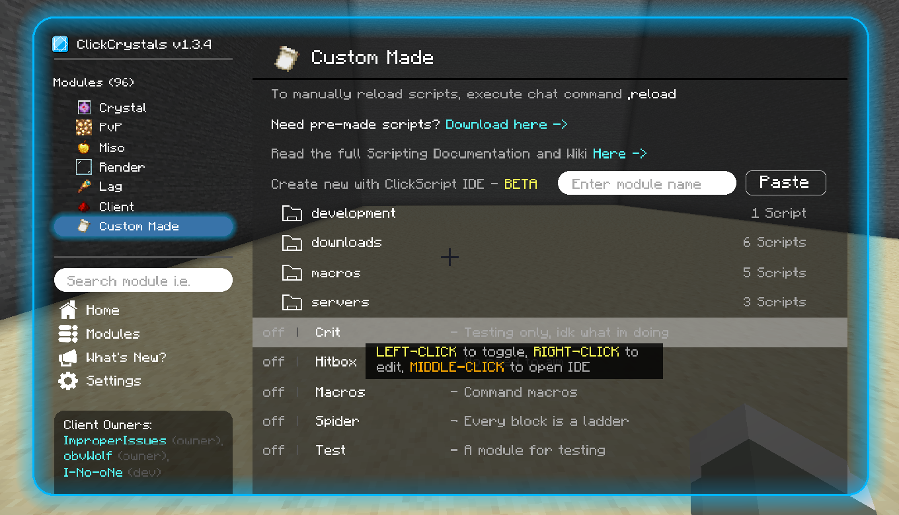

# Click GUI

ClickCrystals offers an in-game GUI to help users configure our client. Here you can learn how to open and navigate this GUI.

## Open by key bind

Our default key binding for opening the Click GUI is **apostrophe**.

> `'`

This key is located as shown in the screenshot below.

## Open by command

If somehow you lost your key bind to our GUI, you can trigger it by commands. ClickCrystals has a custom command system with a default prefix of **comma**.

> `,`

The command you want to trigger is `,toggle`.
This will launch the GUI as if the key bind was pressed by the user.

If you want to re-bind your keybind, the command trigger is `,keybinds`. This will launch the key bind settings screen for the user.

## Navigating Click GUI

Once the GUI first opens you will be introduced to the Home Screen. Upon reaching this screen, click on "Browse Modules" on the bottom right to navigate to our modules browsing screen.

In the browsing screen, you will be provided with lots of modules to interact with. Here's how you can interact with them.

| Action         | Description     |
|----------------|-----------------|
| LEFT CLICK     | toggle on/off   |
| RIGHT CLICK    | edit settings   |
| MIDDLE CLICK   | edit script     |

