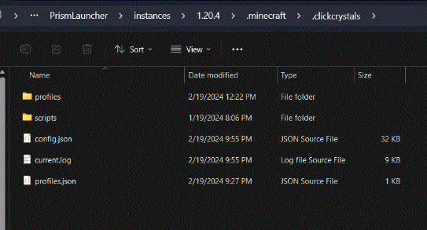

# Start Scripting

When ClickCrystals first launches, it would create a folder named `.clickcrystals` 
inside of your `.minecraft` folder.

## Navigating Files

To access your `.minecraft` folder, press `Win+R` and type the following. A folder should pop up and in it select `.minecraf`. 
Inside of that folder you should see another one at the top named `.clickcrystals`.

There are a few key components in your .clickcrystals folder. 
These include your:
- config
- clickcrystals log
- profile data
- profiles folder
- `scripts folder` 

This wiki will be covering the scripts folder located in `.minecraft/.clickcrystals/scripts`.

## Navigating With VSCode

VSCode provides a fast and easier way to navigate your folders and files. 
The auto bracket enclosure and indentation provides a smoother development experience. 
If you do not have VSCode installed, you can use their [web version](https://vscode.dev/).

## Opening ClickCrystals Folder In-Game
To use VSCode, you must first open a folder locally. To do this type the command `,folder` in chat. 
Remember that the default command prefix bind is set to comma.

You can then open this folder to VSCode by clicking on the “Open Folder” button and then selecting the `.clickcrystals` folder.

## Creating Script Files

Now that you have everything set up in VSCode, you can start creating your script files. 
To do this click on the “New File” icon at the top of the navigation bar.

Name the file whatever you want, but the convention is to have all lowercase with hyphens instead of spaces or underscores. 
The file name extension, however, remains as `.ccs` at all times.

Once the file has been created, an editor would open to the right. 
Now you can start scripting! Remember to `Ctrl+S` to save any changes.

## Reloading Scripts
All script files can be reloaded by simply executing our custom client command `,ccs reload-scripts`

_Do note that upon reloading scripts, all custom scripted modules will be disabled._ 

Scripted modules save to the same config that other modules do. 
To avoid this, there is a new command `,reload` that reloads the entire ClickCrystals Client. 
_This would reload all scripts along with the client, and turn back on the modules that were disabled before._

[[<-- Back]](./clickgui.md) | [[DOCUMENTATION -->]](./DOCUMENTATION/legend.md)